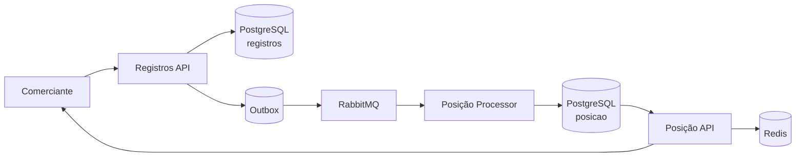

<p align="center">
  
</p>

<p align="center">
  <a href="https://github.com/robsonmazevedo/solidus/actions/workflows/ci.yml">
    
  </a>
  &nbsp;
  
  
  
  
  
</p>

<p align="center">
  <strong>Controle de fluxo de caixa para comerciantes.</strong><br />
  <sub>Serviços separados para registro de lançamentos e consulta de posição diária.</sub>
</p>

<p align="center">
  <a href="#visao-geral"></a>
  <a href="#arquitetura"></a>
  <a href="#inicio-rapido"></a>
  <a href="#apis"></a>
</p>

<p align="center">
  <a href="#observabilidade"></a>
  <a href="#testes"></a>
  <a href="#documentacao"></a>
  <a href="#licenca"></a>
</p>

---

<a id="visao-geral"></a>
## Visão geral

O Solidus é um sistema de controle de fluxo de caixa para comerciantes. Ele separa o registro de movimentações financeiras da consulta de saldo diário consolidado.

Os componentes principais são:

- `Registros API`: recebe e persiste lançamentos.
- `Posição Processor`: consome eventos e atualiza o consolidado diário.
- `Posição API`: expõe a consulta da posição diária.

O fluxo de registro e o fluxo de consulta são desacoplados. Isso permite que o serviço de registro continue disponível mesmo quando o serviço de posição estiver temporariamente indisponível.

<table>
  <tr>
    <td valign="top" width="33%">
      <strong>Registros API</strong><br />
      Entrada de lançamentos com persistência transacional e idempotência.
    </td>
    <td valign="top" width="33%">
      <strong>Posição Processor</strong><br />
      Consumo assíncrono dos eventos e atualização do consolidado diário.
    </td>
    <td valign="top" width="33%">
      <strong>Posição API</strong><br />
      Consulta de saldo diário com Redis como camada de leitura.
    </td>
  </tr>
</table>

O domínio de registro e o domínio de posição são isolados. Na prática, isso significa que falhas em leitura e consolidação não bloqueiam o recebimento de novos lançamentos.

---

<a id="arquitetura"></a>
## Arquitetura

| Componente | Porta | Responsabilidade |
|:---|:---:|:---|
| **Registros API** | `8080` | Recebe e persiste lançamentos de crédito e débito |
| **Posição API** | `8081` | Serve o saldo diário consolidado via cache Redis |
| **Posição Processor** | worker | Consome eventos do RabbitMQ e atualiza o saldo |



O caminho crítico de escrita termina no `Registros API`. A atualização da posição acontece depois, de forma assíncrona, por RabbitMQ.

### Fluxo de registro

1. O comerciante envia um `POST /lancamentos`.
2. O `Registros API` persiste o lançamento e grava o evento no outbox na mesma transação.
3. O relay publica o evento no RabbitMQ.
4. O `Posição Processor` consome o evento e atualiza o consolidado.

### Fluxo de consulta

1. O comerciante envia um `GET /posicao/diaria?data=...`.
2. A `Posição API` consulta primeiro o Redis.
3. Em caso de cache miss, lê o PostgreSQL do domínio de posição.
4. A resposta retorna totais de crédito, débito, saldo e data da última atualização.

---

<a id="stack-tecnica"></a>
## Stack técnica

| Camada | Tecnologia |
|:---|:---|
| APIs e Worker | .NET 10, ASP.NET Core, MediatR, MassTransit |
| Banco de dados | PostgreSQL 16 com schemas isolados por domínio |
| Mensageria | RabbitMQ 3.13 com Transactional Outbox |
| Cache | Redis 7 com Cache-Aside e TTL por tipo de data |
| Observabilidade | OpenTelemetry, Jaeger, Prometheus, Grafana |
| Qualidade | xUnit, NSubstitute, FluentAssertions, SonarQube |
| Infra | Docker Compose, GitHub Actions |

---

<a id="estrutura-do-repositorio"></a>
## Estrutura do repositório

```text
src/
  Solidus.Registros.API/
  Solidus.Posicao.API/
  Solidus.Posicao.Processor/
tests/
  Solidus.Registros.Tests/
  Solidus.Posicao.API.Tests/
  Solidus.Posicao.Processor.Tests/
  load/
  scripts/
docs/
  adr/
  arquitetura/
  ddd/
  requisitos/
infra/
  grafana/
  prometheus/
  rabbitmq/
```

---

<a id="inicio-rapido"></a>
## Início rápido

**Pré-requisito:** Docker com o plugin Compose instalado.

### 1. Configure o ambiente

```bash
cp .env.example .env
```

Os valores padrão do `.env.example` já funcionam para ambiente local.

### 2. Suba as stacks em ordem

```bash
# Infraestrutura: PostgreSQL, RabbitMQ, Redis
docker compose -f docker-compose.yml up -d

# Observabilidade: Jaeger, Prometheus, Grafana
docker compose -f docker-compose.obs.yml up -d

# Serviços .NET: Registros API, Posicao API, Posicao Processor
docker compose -f docker-compose.app.yml up -d
```

### 3. Valide que está funcionando

| Verificação | Resultado esperado |
|:---|:---|
| `http://localhost:8080/scalar/v1` | Registros API acessível |
| `http://localhost:8081/scalar/v1` | Posição API acessível |
| `http://localhost:3000` | Grafana ativo |
| `http://localhost:9090/targets` | Prometheus com targets saudáveis |
| `http://localhost:16686` | Jaeger ativo |
| `http://localhost:15672` | RabbitMQ acessível |

Se quiser inspecionar o ambiente completo, suba também as ferramentas auxiliares descritas na seção de observabilidade.

### 4. Acesse os serviços

| Serviço | URL | Autenticação |
|:---|:---|:---|
| Registros API | http://localhost:8080/scalar/v1 | JWT obrigatório |
| Posição API | http://localhost:8081/scalar/v1 | JWT obrigatório |
| Grafana | http://localhost:3000 | credenciais no `.env` |
| Prometheus | http://localhost:9090 | sem autenticação |
| Jaeger | http://localhost:16686 | sem autenticação |
| RabbitMQ | http://localhost:15672 | credenciais no `.env` |

---

<a id="apis"></a>
## APIs

Ambas as APIs exigem JWT HS256 com o claim `comerciante_id`.

O `comerciante_id` do token define o escopo de acesso. O sistema não aceita consultas cruzadas entre comerciantes.

### POST /lancamentos

```http
POST /lancamentos
Authorization: Bearer <token>
Content-Type: application/json
```

```json
{
  "chaveIdempotencia": "pedido-123",
  "tipo": "CREDITO",
  "valor": 150.00,
  "dataCompetencia": "2026-04-15",
  "descricao": "Venda balcao"
}
```

Retorna `201 Created` para novo lançamento ou `200 OK` se a chave de idempotência já foi processada.

Regras principais:

- `tipo`: `CREDITO` ou `DEBITO`
- `valor`: maior que zero
- `dataCompetencia`: não pode ser futura
- `chaveIdempotencia`: única por comerciante

### GET /posicao/diaria

```http
GET /posicao/diaria?data=2026-04-15
Authorization: Bearer <token>
```

```json
{
  "data": "2026-04-15",
  "totalCreditos": 500.00,
  "totalDebitos": 120.00,
  "saldo": 380.00,
  "atualizadoEm": "2026-04-15T18:42:00Z"
}
```

Quando não há lançamentos no dia, retorna zeros. Datas futuras retornam `422`.

### Autenticação

O `comerciante_id` do token é o único filtro aceito pelos endpoints.

Para gerar um token de desenvolvimento, use [jwt.io](https://jwt.io) com os valores de `JWT_SECRET` e `JWT_ISSUER` definidos no `.env`:

```json
{
  "sub": "<uuid-do-comerciante>",
  "comerciante_id": "<uuid-do-comerciante>",
  "iss": "<JWT_ISSUER>"
}
```

---

<a id="observabilidade"></a>
## Observabilidade

O ambiente de observabilidade inclui Grafana, Prometheus e Jaeger.

| Dashboard | O que monitora |
|:---|:---|
| Registros | Throughput de lançamentos, latência p99, taxa de erro |
| Posição | Fila RabbitMQ, hit/miss do cache Redis, eventos pendentes no outbox |

O Prometheus coleta métricas de 5 targets: `registros-api`, `posicao-api`, `posicao-processor`, `rabbitmq` e `redis-exporter`. Status em `http://localhost:9090/targets`.

### Ferramentas de inspeção

```bash
docker compose -f docker-compose.tools.yml up -d
```

| Ferramenta | URL | Acesso |
|:---|:---|:---|
| pgAdmin | http://localhost:8084 | credenciais no `.env` |
| RedisInsight | http://localhost:5540 | sem autenticação |
| SonarQube | http://localhost:9000 | padrão da ferramenta, alterar no primeiro acesso |

Para rodar a análise SonarQube, gere um token na interface e execute:

```powershell
$env:SONAR_TOKEN = "token-gerado-no-sonarqube"
.\tests\scripts\executar-sonar.ps1
```

---

<a id="testes"></a>
## Testes

```bash
dotnet test Solidus.slnx
```

Os testes estão organizados em 3 projetos, cobrindo domínio, handlers, controllers, repositórios e isolamento por `comerciante_id`.

| Projeto |
|:---|
| Solidus.Registros.Tests |
| Solidus.Posicao.API.Tests |
| Solidus.Posicao.Processor.Tests |

### Validação do NFR principal

Confirma que o serviço de Registros permanece disponível mesmo com a Posição completamente indisponível:

```powershell
.\tests\scripts\validar-nfr.ps1
```

O script para a Posição, registra um lançamento, reinicia os serviços e aguarda a consolidação automática via RabbitMQ (até 60s).

---

<a id="documentacao"></a>
## Documentação

### Requisitos e domínio

| Documento | Conteúdo |
|:---|:---|
| [docs/requisitos/RF.md](docs/requisitos/RF.md) | Regras de negócio detalhadas |
| [docs/requisitos/RNF.md](docs/requisitos/RNF.md) | Requisitos não funcionais e critérios de aceite |
| [docs/ddd/domains.md](docs/ddd/domains.md) | Mapeamento dos domínios |
| [docs/ddd/bounded-contexts.md](docs/ddd/bounded-contexts.md) | Fronteiras entre contextos |
| [docs/ddd/ubiquitous-language.md](docs/ddd/ubiquitous-language.md) | Glossário do domínio |

### Arquitetura

| Documento | Conteúdo |
|:---|:---|
| [docs/arquitetura/c4-context.md](docs/arquitetura/c4-context.md) | Contexto do sistema |
| [docs/arquitetura/c4-containers.md](docs/arquitetura/c4-containers.md) | Visão de containers |
| [docs/arquitetura/c4-components.md](docs/arquitetura/c4-components.md) | Componentes internos |
| [docs/arquitetura/sequences.md](docs/arquitetura/sequences.md) | Diagramas de sequência |
| [docs/arquitetura/data-model.md](docs/arquitetura/data-model.md) | Modelo de dados |
| [docs/arquitetura/escalabilidade.md](docs/arquitetura/escalabilidade.md) | Estratégia de escala |
| [docs/arquitetura/observabilidade.md](docs/arquitetura/observabilidade.md) | Métricas, logs e traces |
| [docs/arquitetura/seguranca.md](docs/arquitetura/seguranca.md) | Aspectos de segurança |
| [docs/arquitetura/transicao.md](docs/arquitetura/transicao.md) | Estratégia de migração incremental do legado para o Solidus |
| [docs/arquitetura/evolucoes.md](docs/arquitetura/evolucoes.md) | Evoluções futuras e caminhos técnicos possíveis |

### ADRs

| # | Decisão |
|:---|:---|
| [ADR-001](docs/adr/adr-001-comunicacao-assincrona.md) | Comunicação assíncrona entre os domínios |
| [ADR-002](docs/adr/adr-002-transactional-outbox.md) | Transactional Outbox para publicação confiável |
| [ADR-003](docs/adr/adr-003-read-model.md) | Read model materializado para a posição diária |
| [ADR-004](docs/adr/adr-004-redis-cache-distribuido.md) | Redis como cache distribuído |
| [ADR-005](docs/adr/adr-005-bancos-separados.md) | Bancos de dados separados por domínio |

---

<a id="licenca"></a>
## Licença

Este projeto está licenciado sob a licença descrita em [LICENSE](LICENSE).