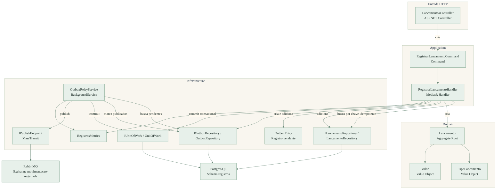
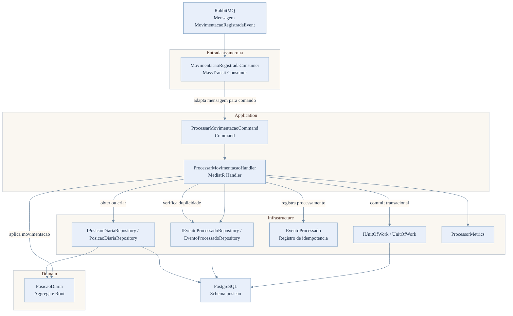
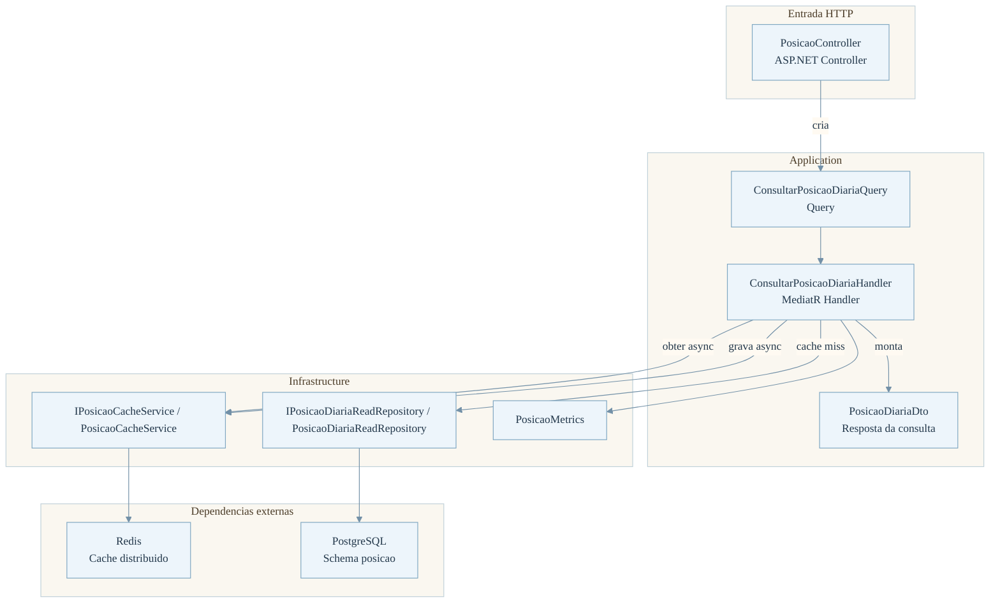
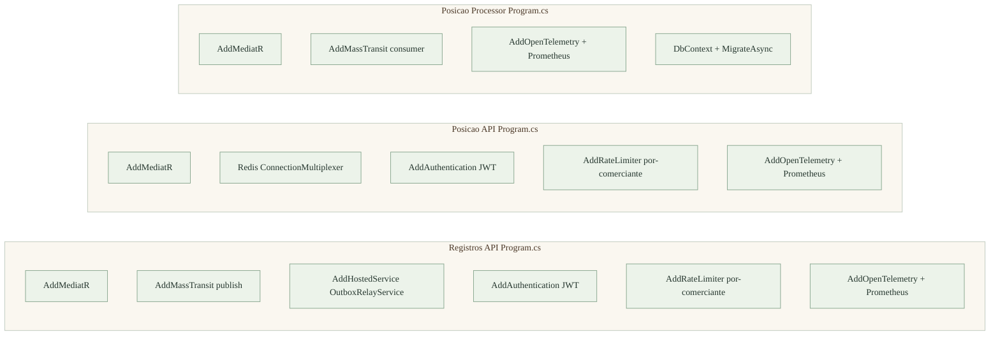
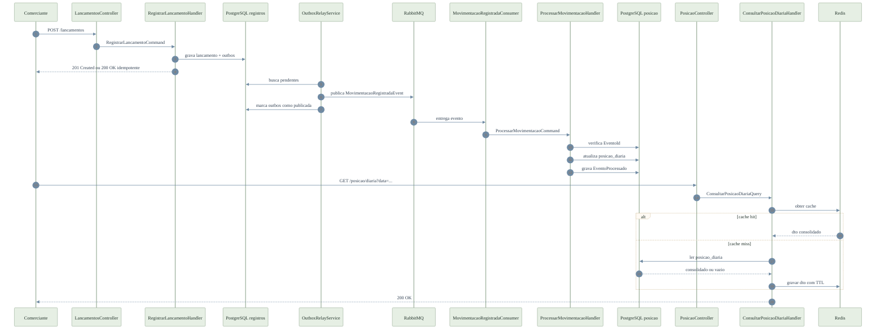

# Arquitetura Alvo — Código (C4 Nível 4)

## 1. Propósito

Este documento detalha o nível 4 do modelo C4 para o Solidus. O foco deixa de ser o componente lógico e passa a ser o código relevante à arquitetura: classes, interfaces, handlers, agregados, serviços de infraestrutura e fronteiras transacionais que implementam os fluxos principais do sistema.

O objetivo não é mapear todo tipo existente no repositório, mas sim tornar explícito como o comportamento arquitetural é realizado no código executável.

---

## 2. Escopo

Entram neste nível:

- Controllers, consumers e handlers que controlam fluxo
- Agregados e value objects que encapsulam regras de negócio
- Repositórios, unit of work e serviços de infraestrutura que sustentam garantias arquiteturais
- Pontos de observabilidade, autenticação e bootstrap que impactam o comportamento do sistema

Ficam fora deste nível:

- Detalhes de mapeamento do EF Core
- Arquivos gerados em `bin`, `obj` e `TestResults`
- Configurações internas de RabbitMQ, Redis e PostgreSQL
- Classes de teste e detalhes de framework sem impacto arquitetural direto

---

## 3. Registros API

### 3.1 Responsabilidade arquitetural

O `Registros API` implementa o caso de uso de escrita do sistema. Seu papel é validar a identidade do comerciante, registrar o lançamento, garantir idempotência por chave e persistir o evento de integração na outbox dentro da mesma transação.

### 3.2 Código relevante

### 3.3 Fluxo principal

1. `LancamentosController` extrai o claim `comerciante_id`, monta `RegistrarLancamentoCommand` e delega a execução ao MediatR.
2. `RegistrarLancamentoHandler` consulta `ILancamentoRepository.BuscarPorChaveIdempotenciaAsync` para resolver retries idempotentes.
3. Não havendo lançamento prévio, o handler chama `Lancamento.Registrar`, que aplica as invariantes de domínio com `TipoLancamento.Parse` e `Valor.Criar`.
4. O handler cria um `MovimentacaoRegistradaEvent`, serializa o payload e registra um `OutboxEntry`.
5. `ILancamentoRepository`, `IOutboxRepository` e `IUnitOfWork` garantem que lançamento e outbox sejam persistidos atomicamente.
6. `OutboxRelayService` executa polling periódico, busca pendências, publica no broker via `IPublishEndpoint` e marca os itens como publicados.

---

## 4. Posição Processor

### 4.1 Responsabilidade arquitetural

O `Posição Processor` projeta o evento de movimentação para o read model consolidado. Seu papel é consumir a mensagem, garantir idempotência por `EventoId`, aplicar a atualização no agregado de posição diária e persistir o registro de processamento na mesma transação.

### 4.2 Código relevante

### 4.3 Fluxo principal

1. `MovimentacaoRegistradaConsumer` recebe `MovimentacaoRegistradaEvent` do RabbitMQ e o adapta para `ProcessarMovimentacaoCommand`.
2. `ProcessarMovimentacaoHandler` consulta `IEventoProcessadoRepository.ExisteAsync` para descartar reentregas do mesmo evento.
3. O handler usa `IPosicaoDiariaRepository.ObterOuCriarAsync` para recuperar ou inicializar a posição do comerciante na data da competência.
4. `PosicaoDiaria.AplicarMovimentacao` recalcula créditos, débitos e saldo.
5. O handler cria `EventoProcessado.Registrar` e persiste esse registro como prova de processamento.
6. `IUnitOfWork.CommitAsync` fecha a transação que grava a nova posição e a marcação de idempotência.

---

## 5. Posição API

### 5.1 Responsabilidade arquitetural

O `Posição API` expõe a leitura do consolidado diário. Seu papel é validar a consulta, aplicar isolamento por comerciante, tentar o cache distribuído primeiro e buscar o banco apenas em caso de `cache miss`.

### 5.2 Código relevante

### 5.3 Fluxo principal

1. `PosicaoController` valida se a data não é futura, obtém `comerciante_id` do token e delega a execução ao MediatR.
2. `ConsultarPosicaoDiariaHandler` registra a consulta em `PosicaoMetrics`.
3. O handler chama `IPosicaoCacheService.ObterAsync`.
4. Em `cache hit`, retorna imediatamente o `PosicaoDiariaDto`.
5. Em `cache miss`, busca o dado em `IPosicaoDiariaReadRepository.ObterAsync`.
6. Se não houver consolidado persistido, retorna um DTO zerado.
7. Se houver dado, grava o DTO em Redis por meio de `IPosicaoCacheService.GravarAsync`.

---

## 6. Bootstrap Arquitetural Relevante

Os arquivos `Program.cs` dos três serviços participam do nível 4 apenas nos pontos que afetam comportamento arquitetural:

- Registro do MediatR como barramento in-process para commands e queries
- Configuração do MassTransit para publicação e consumo de `MovimentacaoRegistradaEvent`
- Registro de `OutboxRelayService` como `HostedService`
- Autenticação JWT e autorização nos dois serviços HTTP
- Rate limit por `comerciante_id`
- OpenTelemetry e Prometheus para métricas e tracing
- Health checks dos serviços e do banco

---

## 7. Fluxo Consolidado Fim a Fim

