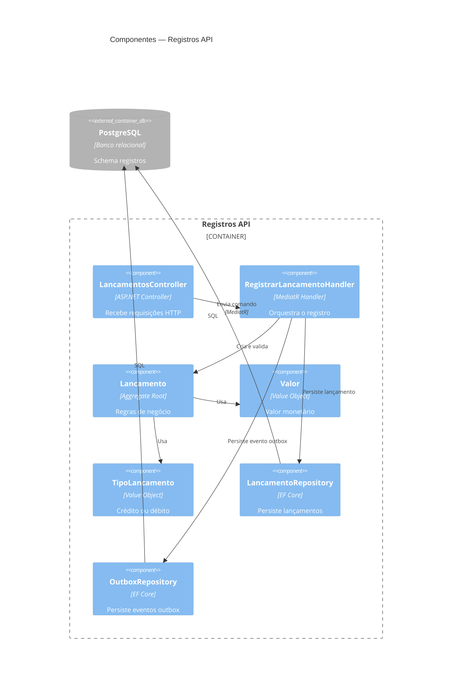
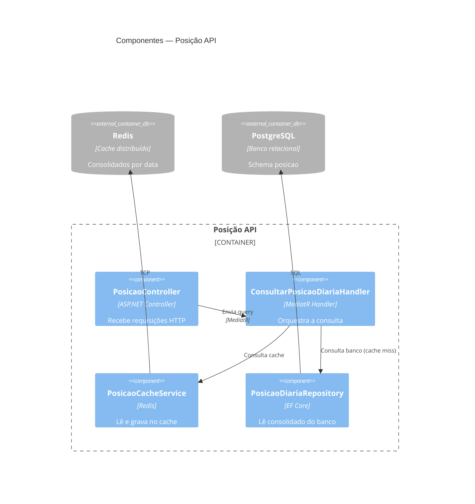
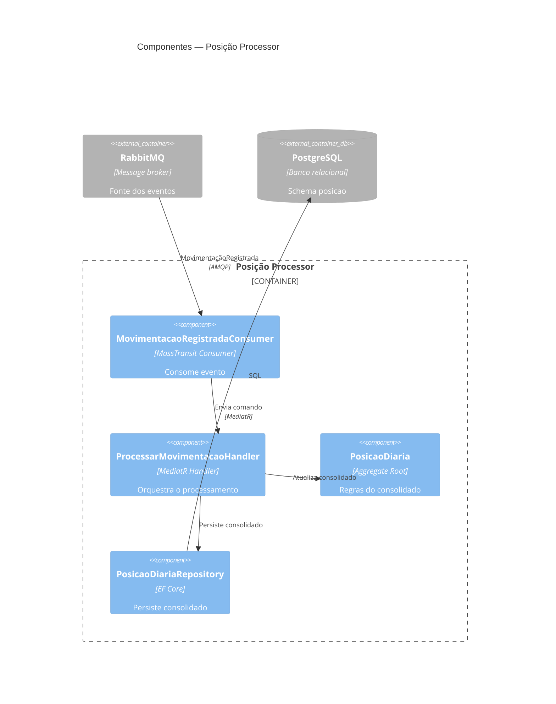

# Arquitetura Alvo — Componentes (C4 Nível 3)

## 1. Propósito

O diagrama de componentes detalha o interior de cada serviço, mostrando como a Clean Architecture organiza as responsabilidades em camadas: API, Application, Domain e Infrastructure.

---

## 2. Registros API

### Elementos

| Componente | Camada | Descrição |
|------------|--------|-----------|
| LancamentosController | API | Recebe e valida a requisição HTTP. Delega ao handler via MediatR |
| RegistrarLancamentoHandler | Application | Orquestra o caso de uso: cria o agregado, persiste e grava o evento de saída na mesma transação |
| Lancamento | Domain | Aggregate root. Contém as regras de negócio do lançamento financeiro |
| Valor | Domain | Value object que encapsula o valor monetário e garante que seja positivo |
| TipoLancamento | Domain | Value object que representa crédito ou débito |
| LancamentoRepository | Infrastructure | Persiste e recupera lançamentos no banco de dados |
| OutboxRepository | Infrastructure | Persiste eventos de saída na mesma transação do lançamento |

---

## 3. Posição API

### Elementos

| Componente | Camada | Descrição |
|------------|--------|-----------|
| PosicaoController | API | Recebe a requisição HTTP e delega ao handler via MediatR |
| ConsultarPosicaoDiariaHandler | Application | Aplica Cache-Aside: consulta o cache primeiro; em caso de miss, consulta o banco e atualiza o cache |
| PosicaoCacheService | Infrastructure | Abstração sobre o Redis para leitura e escrita do consolidado diário |
| PosicaoDiariaRepository | Infrastructure | Lê o consolidado diário diretamente do banco quando o cache não tem o dado |

---

## 4. Posição Processor

### Elementos

| Componente | Camada | Descrição |
|------------|--------|-----------|
| MovimentacaoRegistradaConsumer | Infrastructure | Recebe o evento do broker e garante idempotência antes de processar |
| ProcessarMovimentacaoHandler | Application | Orquestra a atualização do consolidado diário a partir do evento recebido |
| PosicaoDiaria | Domain | Aggregate root que contém as regras de cálculo do saldo diário |
| PosicaoDiariaRepository | Infrastructure | Persiste e recupera o consolidado diário no banco de dados |
