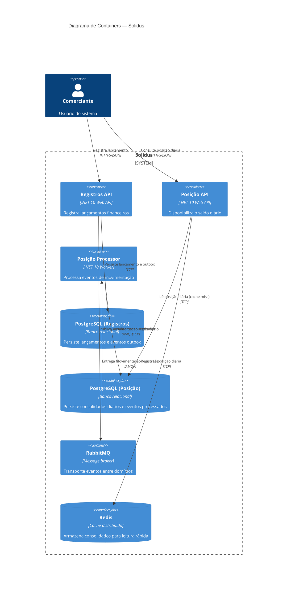

# Arquitetura Alvo — Containers (C4 Nível 2)

## 1. Propósito

O diagrama de containers detalha o interior do sistema Solidus, mostrando os serviços, banco de dados, broker de mensagens e cache que o compõem, bem como as interações entre eles.

---

## 2. Diagrama

---

## 3. Elementos

| Elemento | Tipo | Tecnologia | Descrição |
|----------|------|-----------|-----------|
| Comerciante | Pessoa | | Usuário que interage com o sistema via API |
| Registros API | Serviço | .NET 10 Web API | Ponto de entrada para registro de lançamentos. Persiste o lançamento e o evento de saída na mesma transação via Transactional Outbox |
| Posição API | Serviço | .NET 10 Web API | Ponto de entrada para consulta do saldo diário. Aplica Cache-Aside com Redis para baixa latência |
| Posição Processor | Serviço | .NET 10 Worker | Consome eventos do broker e atualiza o consolidado diário de forma assíncrona e independente |
| PostgreSQL (Registros) | Banco de dados | Relacional | Armazena os lançamentos financeiros e os eventos pendentes de publicação (outbox) |
| PostgreSQL (Posição) | Banco de dados | Relacional | Armazena os consolidados diários por comerciante e o registro de eventos já processados |
| RabbitMQ | Broker | AMQP | Desacopla os dois domínios. A indisponibilidade do domínio de Posição não afeta o domínio de Registros |
| Redis | Cache | In-memory | Armazena o consolidado por data para atender consultas com alta frequência sem pressionar o banco |
