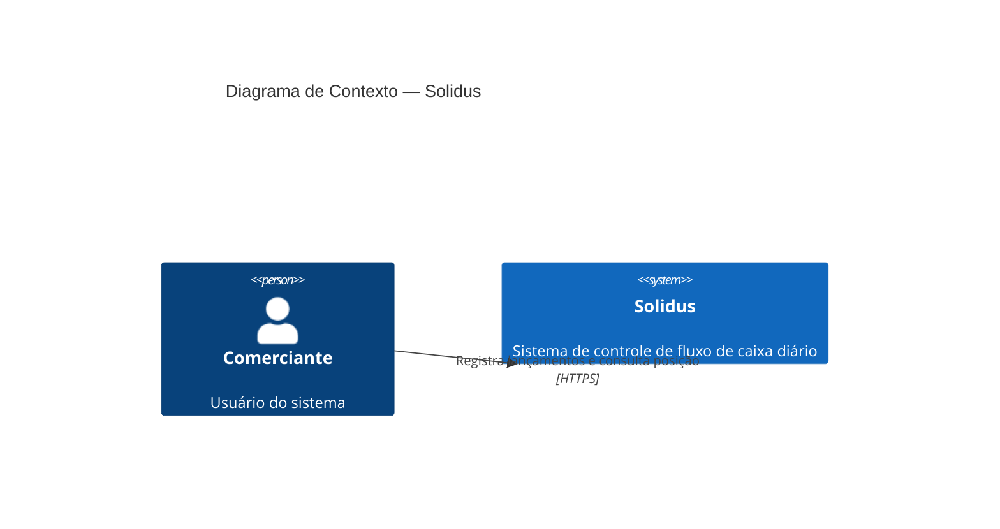

# Arquitetura Alvo — Contexto do Sistema (C4 Nível 1)

## 1. Propósito

O diagrama de contexto apresenta o sistema Solidus e sua relação com os atores externos. Neste nível, o sistema é tratado como uma caixa preta. O foco está em quem interage com ele e de que forma.

---

## 2. Diagrama

---

## 3. Elementos

| Elemento | Tipo | Descrição |
|----------|------|-----------|
| Comerciante | Pessoa | Usuário do sistema. Registra entradas e saídas financeiras e consulta o saldo consolidado de qualquer dia |
| Solidus | Sistema | Sistema de controle de fluxo de caixa. Recebe lançamentos, garante sua integridade e disponibiliza a posição financeira diária consolidada |
