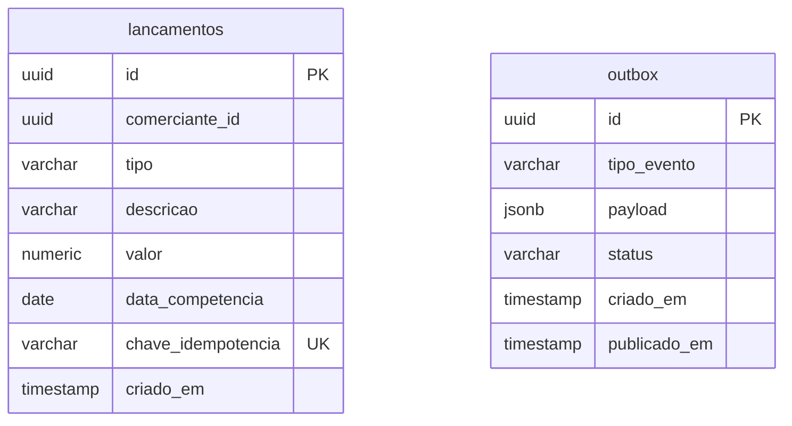
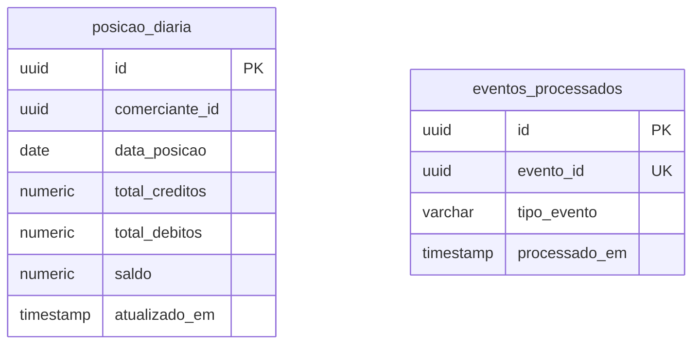

# Arquitetura Alvo — Modelagem de Dados

## 1. Propósito

Define os schemas, tabelas, tipos de dados, constraints e índices que suportam os dois domínios do sistema. Cada domínio possui seu próprio schema no PostgreSQL, garantindo isolamento físico dos dados.

---

## 2. Schema `registros`

### Tabela `lancamentos`

| Coluna | Tipo | Constraint | Descrição |
|--------|------|-----------|-----------|
| id | uuid | PK | Identificador interno do lançamento |
| comerciante_id | uuid | NOT NULL | Identificador do comerciante dono do lançamento |
| tipo | varchar(7) | NOT NULL | `CREDITO` ou `DEBITO` |
| descricao | varchar(255) | NULL | Descrição opcional da movimentação |
| valor | numeric(18,2) | NOT NULL CHECK (valor > 0) | Valor monetário positivo |
| data_competencia | date | NOT NULL | Data à qual o lançamento pertence |
| chave_idempotencia | varchar(64) | UNIQUE NOT NULL | Garante que a mesma operação não seja registrada mais de uma vez |
| criado_em | timestamp | NOT NULL DEFAULT now() | Data e hora do registro |

### Tabela `outbox`

| Coluna | Tipo | Constraint | Descrição |
|--------|------|-----------|-----------|
| id | uuid | PK | Identificador do evento de saída |
| tipo_evento | varchar(100) | NOT NULL | Nome do evento, ex: `MovimentacaoRegistrada` |
| payload | jsonb | NOT NULL | Dados do evento serializados |
| status | varchar(10) | NOT NULL DEFAULT `PENDENTE` | `PENDENTE` ou `PUBLICADO` |
| criado_em | timestamp | NOT NULL DEFAULT now() | Data e hora de criação |
| publicado_em | timestamp | NULL | Data e hora da publicação no broker |

> **Decisão de design:** a tabela `outbox` não possui chave estrangeira para `lancamentos`. O payload contém todos os dados necessários para o processamento pelo consumidor. A ausência da FK evita acoplamento entre as tabelas e simplifica a exclusão futura de registros antigos da outbox sem impacto em `lancamentos`.

### Índices — schema `registros`

| Tabela | Coluna(s) | Tipo | Justificativa |
|--------|-----------|------|--------------|
| lancamentos | chave_idempotencia | UNIQUE | Verificação de duplicidade na inserção |
| lancamentos | comerciante_id, data_competencia | BTREE | Consultas por comerciante e período |
| outbox | status, criado_em | BTREE | Seleção de eventos pendentes pelo relay |

---

## 3. Schema `posicao`

### Tabela `posicao_diaria`

| Coluna | Tipo | Constraint | Descrição |
|--------|------|-----------|-----------|
| id | uuid | PK | Identificador do consolidado |
| comerciante_id | uuid | NOT NULL | Identificador do comerciante |
| data_posicao | date | NOT NULL | Data do consolidado |
| total_creditos | numeric(18,2) | NOT NULL DEFAULT 0 | Soma dos créditos do dia |
| total_debitos | numeric(18,2) | NOT NULL DEFAULT 0 | Soma dos débitos do dia |
| saldo | numeric(18,2) | NOT NULL DEFAULT 0 | `total_creditos - total_debitos` |
| atualizado_em | timestamp | NOT NULL DEFAULT now() | Última atualização do consolidado |

### Tabela `eventos_processados`

| Coluna | Tipo | Constraint | Descrição |
|--------|------|-----------|-----------|
| id | uuid | PK | Identificador interno |
| evento_id | uuid | UNIQUE NOT NULL | Identificador do evento recebido do broker |
| tipo_evento | varchar(100) | NOT NULL | Tipo do evento processado |
| processado_em | timestamp | NOT NULL DEFAULT now() | Data e hora do processamento |

### Índices — schema `posicao`

| Tabela | Coluna(s) | Tipo | Justificativa |
|--------|-----------|------|--------------|
| posicao_diaria | comerciante_id, data_posicao | UNIQUE | Garante um consolidado por comerciante por dia e acelera consultas |
| eventos_processados | evento_id | UNIQUE | Verificação de idempotência na chegada de eventos |
