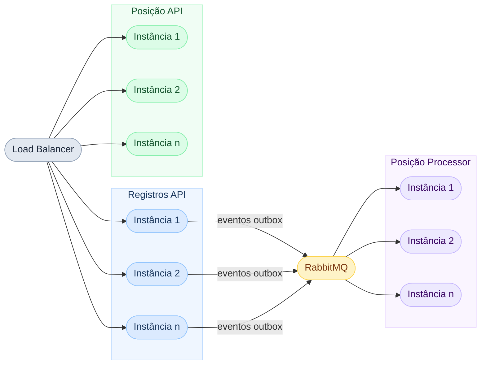

# Escalabilidade e Resiliência

## 1. Escalabilidade horizontal

O Solidus foi desenhado para escalar horizontalmente desde a primeira decisão arquitetural. Cada serviço é stateless por construção: nenhuma instância guarda estado entre requisições.

### O que torna cada serviço stateless

| Serviço | Decisão que garante stateless |
|---------|------------------------------|
| Registros API | Identidade do comerciante vem do token JWT, não de sessão. Nenhum dado é mantido em memória entre requisições |
| Posição API | Cache compartilhado no Redis, não em memória local. Qualquer instância serve qualquer requisição com o mesmo resultado |
| Posição Processor | Idempotência garantida pela tabela `eventos_processados`. Múltiplas instâncias podem consumir a mesma fila sem duplicar processamento |

### Capacidade de escala por serviço

| Serviço | Escala por | Limitante natural |
|---------|-----------|------------------|
| Registros API | Adição de instâncias atrás do load balancer | Throughput de escrita no PostgreSQL Registros |
| Posição API | Adição de instâncias atrás do load balancer | Cache hit rate do Redis; throughput de leitura no PostgreSQL Posição |
| Posição Processor | Adição de instâncias consumindo a mesma fila | Throughput de escrita no PostgreSQL Posição |

### Diagrama de escala horizontal



---

## 2. Balanceamento de carga

O load balancer distribui requisições entre as instâncias disponíveis usando round-robin com health check ativo. Instâncias que não respondem ao health check são removidas da rotação automaticamente e reinseridas após se recuperarem.

### Health checks

Cada serviço expõe um endpoint `/health` com três verificações:

| Verificação | O que valida |
|------------|-------------|
| Liveness | O processo está vivo e respondendo |
| Readiness | As dependências obrigatórias estão acessíveis (banco, broker) |
| Startup | A inicialização do serviço foi concluída com sucesso |

O load balancer usa o endpoint de readiness para decidir se uma instância está apta a receber tráfego. Uma instância que perdeu conexão com o banco é removida da rotação até se reconectar, sem impactar as demais.

### Redis como viabilizador do balanceamento

Sem cache distribuído, cada instância da Posição API teria seu próprio cache em memória. O load balancer enviaria a mesma requisição para instâncias diferentes com caches em estados diferentes, produzindo respostas inconsistentes. O Redis elimina esse problema: todas as instâncias leem e escrevem no mesmo cache, e o balanceamento é transparente para o cliente.

---

## 3. Recuperação de falhas

### Retry com exponential backoff

Chamadas ao banco de dados e ao Redis usam retry automático com exponential backoff. Falhas transitórias de rede ou sobrecarga momentânea são recuperadas sem propagação de erro para o cliente.

| Componente | Tentativas | Backoff inicial | Backoff máximo |
|-----------|-----------|----------------|---------------|
| PostgreSQL | 3 | 200ms | 2s |
| Redis | 3 | 100ms | 1s |
| RabbitMQ (relay) | 5 | 500ms | 30s |

### Circuit breaker no Redis

O acesso ao Redis é protegido por circuit breaker. Se o Redis ficar indisponível, o circuit breaker abre e as requisições à Posição API fazem fallback direto para o banco. O circuit breaker fecha automaticamente quando o Redis volta a responder.

```
Redis disponível   → Cache-Aside normal (Redis primeiro, banco como fallback)
Redis indisponível → Circuit breaker aberto → leitura direta no banco
Redis recuperado   → Circuit breaker fecha → Cache-Aside retomado
```

O cliente não percebe a indisponibilidade do Redis. A latência aumenta durante o período de fallback, mas o serviço permanece disponível.

### Dead Letter Queue (DLQ)

Mensagens que falham no Posição Processor após todas as tentativas de retry são movidas automaticamente para uma DLQ. Isso impede que uma mensagem corrompida ou com dados inválidos bloqueie o processamento das demais.

| Situação | Comportamento |
|----------|--------------|
| Falha transitória | Retry com backoff; mensagem reprocessada com sucesso |
| Falha persistente após N tentativas | Mensagem movida para DLQ; restante da fila continua processando |
| DLQ com mensagens | Alerta disparado (conforme `observabilidade.md`); análise manual e reprocessamento |

### Transactional Outbox como garantia de entrega

O relay da outbox garante que eventos não sejam perdidos mesmo durante indisponibilidade do broker. Enquanto o broker estiver fora do ar, os eventos acumulam na tabela `outbox` com status `PENDENTE`. Quando o broker volta, o relay os publica na ordem em que foram criados.

| Cenário | Comportamento |
|---------|--------------|
| Broker indisponível durante `POST /lancamentos` | Lançamento persistido; evento na outbox; relay tenta publicar com retry |
| Broker volta após indisponibilidade | Relay publica todos os eventos pendentes; Processor os consome em ordem |
| Relay para de executar | Eventos acumulam na outbox; alerta disparado; sem perda de dados |

---

## 4. Portabilidade entre provedores

As decisões abaixo garantem que o Solidus rode em qualquer provedor sem alteração de código ou arquitetura.

| Componente | Escolha | Por que é portável |
|-----------|---------|-------------------|
| Serviços .NET | Containers Docker | Rodam em qualquer orquestrador: Kubernetes, ECS, AKS, GKE, Container Apps |
| PostgreSQL | Tecnologia aberta | Disponível como serviço gerenciado em AWS (RDS), Azure (Flexible Server) e GCP (Cloud SQL) ou self-managed |
| RabbitMQ | Tecnologia aberta | Self-managed em containers ou gerenciado: Amazon MQ, Azure Service Bus com protocolo AMQP |
| Redis | Tecnologia aberta | Disponível como serviço gerenciado em AWS (ElastiCache), Azure (Cache for Redis) e GCP (Memorystore) ou self-managed |
| Observabilidade | OpenTelemetry | Padrão aberto; exporta para Jaeger, Prometheus, Datadog, New Relic ou qualquer backend compatível sem mudança de código |
| Configuração | Variáveis de ambiente | Padrão universal; funciona em docker-compose, Kubernetes Secrets, Azure Key Vault e AWS Secrets Manager |

Nenhuma biblioteca proprietária de nuvem é usada no código dos serviços. A troca de provedor requer apenas atualizar as variáveis de ambiente e o arquivo de infraestrutura.
