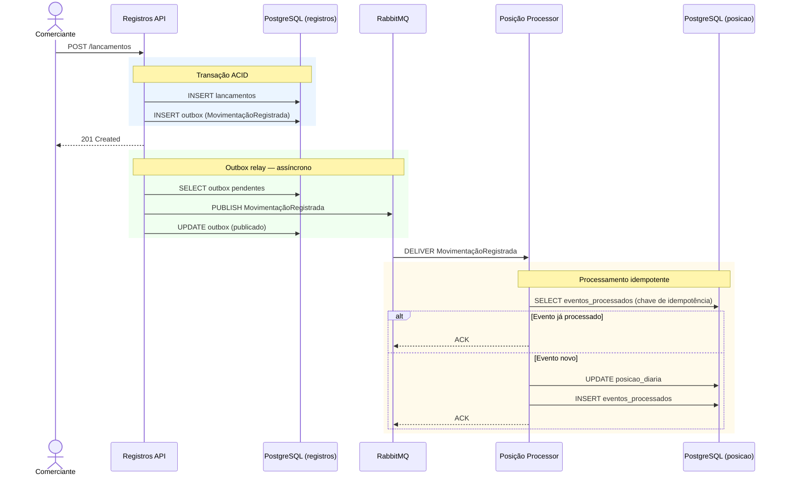
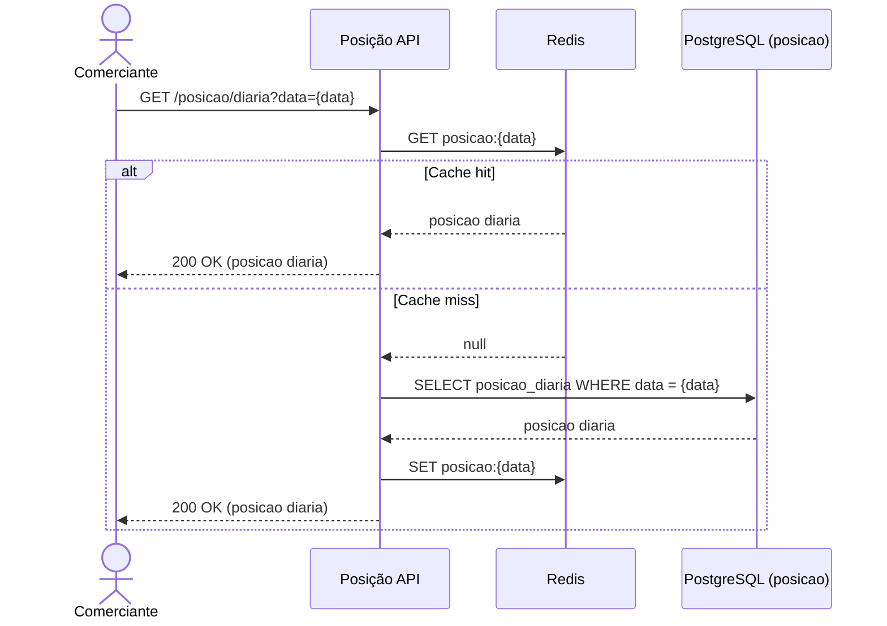

# Arquitetura Alvo — Diagramas de Sequência

## 1. Propósito

Os diagramas de sequência descrevem os fluxos principais do sistema, mostrando a ordem das interações entre os componentes para cada operação.

---

## 2. Fluxo — Registro de lançamento

### Pontos-chave

| Decisão | Justificativa |
|---------|--------------|
| Transactional Outbox | Garante que o lançamento e o evento sejam persistidos atomicamente. Sem risco de publicar sem persistir ou persistir sem publicar |
| Resposta 201 antes da publicação | O comerciante recebe a confirmação do registro imediatamente. A propagação ao domínio de Posição é assíncrona |
| Idempotência no Processor | O broker entrega ao menos uma vez (at-least-once). A verificação impede que o mesmo evento atualize o consolidado mais de uma vez |

---

## 3. Fluxo — Consulta de posição diária

### Pontos-chave

| Decisão | Justificativa |
|---------|--------------|
| Cache-Aside | A posição diária é imutável após consolidada. É um dado de leitura intensiva e altamente cacheável |
| Leitura direta no Redis | Atende o requisito de 50 req/s sem pressionar o banco de dados |
| Fallback para o banco | Garante que o dado esteja sempre disponível, mesmo que o cache esteja frio ou expirado |
| TTL como mecanismo de consistência | O cache do dia corrente usa TTL de 30 segundos; dias anteriores usam TTL de 1 hora. Quando o Posição Processor atualiza o consolidado no banco, o cache expira naturalmente dentro da janela de 60 segundos definida pelo RN-013, sem necessidade de invalidação explícita pelo Processor |
