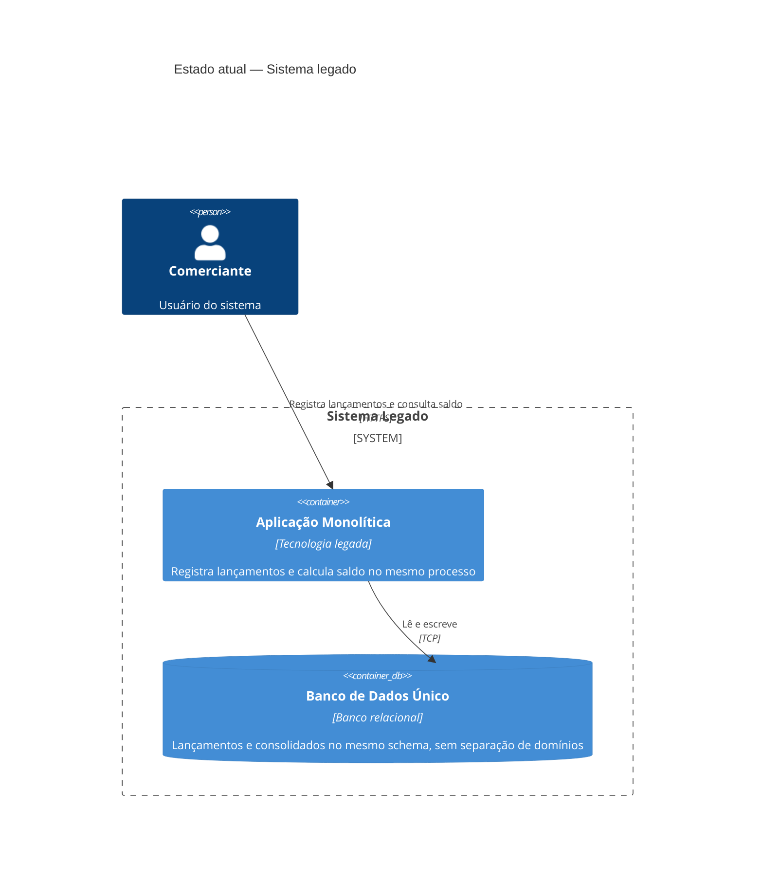
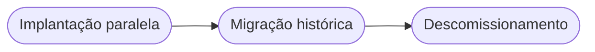
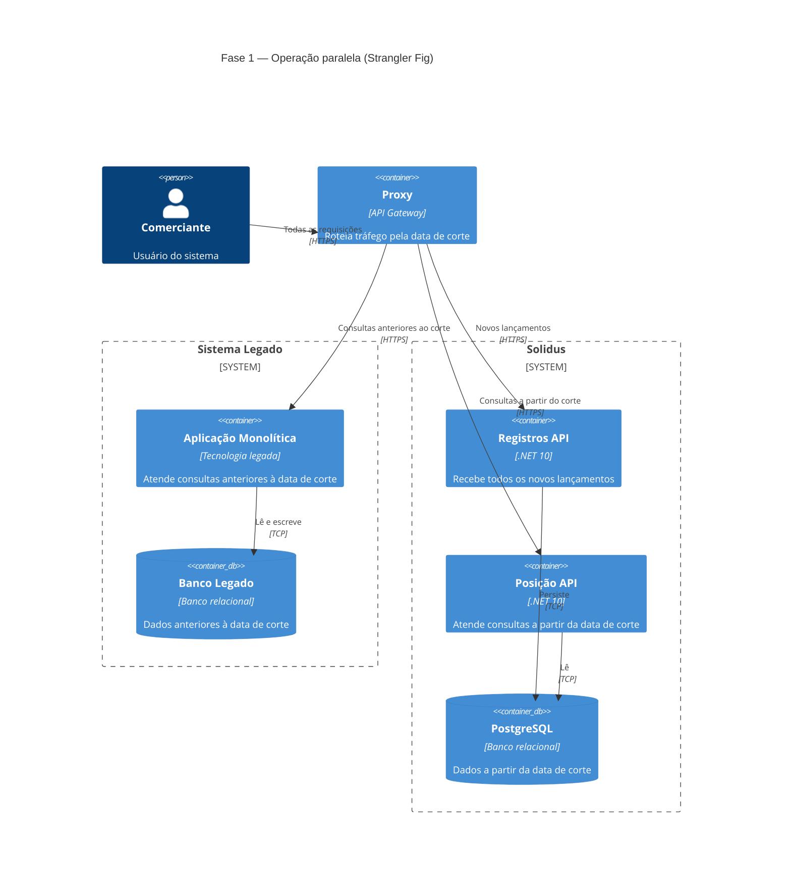

# Arquitetura de Transição

## 1. Contexto

Este documento descreve a estratégia para migrar de um sistema legado hipotético para a arquitetura do Solidus. A premissa é que o comerciante já possui um sistema monolítico em operação: banco de dados único, sem separação de domínios, sem mensageria, com acoplamento direto entre o registro de lançamentos e o cálculo do saldo.

A transição deve ser incremental, sem indisponibilidade para o comerciante e com possibilidade de rollback em qualquer ponto.

---

## 2. Estratégia de migração

O padrão adotado é o Strangler Fig: o novo sistema é implantado em paralelo ao legado. Um proxy (API Gateway ou load balancer) controla o roteamento do tráfego. O legado é gradualmente esvaziado de responsabilidades até que possa ser descomissionado com segurança.

Essa abordagem elimina o risco do big bang: não há uma data de corte em que tudo muda ao mesmo tempo. Cada fase entrega valor e pode ser revertida de forma independente.

---

## 3. Fases de migração

### Fase 1 — Implantação paralela

O Solidus é implantado em produção e passa a receber todo o tráfego novo. O sistema legado continua ativo, servindo apenas o histórico de dados anteriores à migração. Um proxy roteia as requisições: lançamentos e consultas de datas posteriores ao corte vão para o Solidus; consultas de datas anteriores ao corte vão para o legado.

| Atributo | Descrição |
|----------|-----------|
| Critério de entrada | Solidus validado em staging com volume de tráfego equivalente ao de produção |
| Critério de avanço | Solidus estável em produção por período mínimo de 15 dias sem incidentes críticos; paridade funcional confirmada |
| Ponto de rollback | O proxy redireciona 100% do tráfego de volta ao legado. Nenhum dado é perdido pois o Solidus não substituiu o legado ainda |

---

### Fase 2 — Migração histórica

Os dados históricos do legado são migrados para o Solidus em lotes controlados, começando pelos mais antigos. A cada lote, uma amostragem valida a integridade dos dados migrados. O legado permanece ativo durante toda esta fase como fonte de verdade de fallback.

| Atributo | Descrição |
|----------|-----------|
| Critério de entrada | Fase 1 concluída e estável; script de migração testado em staging com dados reais anonimizados |
| Critério de avanço | 100% dos dados históricos migrados e validados por amostragem; consultas ao legado zeradas por pelo menos 7 dias |
| Ponto de rollback | O proxy volta a rotear consultas históricas para o legado. Os dados migrados no Solidus são descartados ou mantidos sem impacto operacional |

---

### Fase 3 — Descomissionamento do legado

Com todos os dados históricos no Solidus e o tráfego 100% roteado para o novo sistema, o legado é desligado. O proxy é removido ou simplificado. O banco de dados do legado é arquivado antes do shutdown definitivo.

| Atributo | Descrição |
|----------|-----------|
| Critério de entrada | Fase 2 concluída; nenhuma requisição ativa roteada para o legado por pelo menos 30 dias |
| Critério de avanço | Shutdown do sistema legado confirmado; banco arquivado em storage frio |
| Ponto de rollback | Até o momento do shutdown, o legado pode ser religado. Após o shutdown, o rollback requer restauração do backup arquivado |

O estado final após a conclusão da Fase 3 é a arquitetura alvo completa, documentada em [c4-containers.md](c4-containers.md).

---

## 4. Riscos

| Fase | Risco | Probabilidade | Impacto | Mitigação |
|------|-------|--------------|---------|-----------|
| 1 | Divergência de comportamento entre Solidus e legado para o mesmo input | Média | Alto | Testes de paridade em staging com dados reais anonimizados antes da entrada em produção |
| 1 | Latência do proxy adicionando overhead perceptível ao comerciante | Baixa | Médio | Benchmark do proxy em staging; SLA de latência monitorado desde o primeiro dia em produção |
| 2 | Inconsistência nos dados migrados por diferença de schema ou encoding | Média | Alto | Validação por amostragem a cada lote; comparação de totais agregados entre legado e Solidus |
| 2 | Volume de dados históricos inviabilizando a migração em janela aceitável | Baixa | Médio | Migração em lotes noturnos com throttle configurável; estimativa de volume feita antes do início da fase |
| 3 | Descoberta de dependência oculta no legado após o shutdown | Baixa | Alto | Auditoria de dependências antes da Fase 3; período de quarentena de 30 dias antes do descomissionamento definitivo |

---

## 5. O que não muda para o comerciante

Durante toda a transição, o comerciante não percebe nenhuma alteração:

| Aspecto | Garantia |
|---------|----------|
| Contrato da API | As rotas, os payloads e os códigos de resposta são idênticos aos do sistema legado |
| Comportamento funcional | As regras de negócio, validações, cálculo de saldo e idempotência produzem os mesmos resultados |
| Disponibilidade | A transição não exige janela de manutenção. O proxy garante continuidade durante a troca |
| Histórico de dados | Os dados anteriores à migração permanecem acessíveis em todas as fases |
