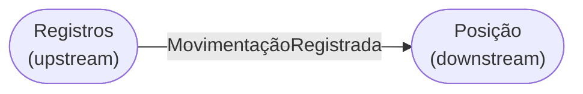

# Mapa de Contextos Delimitados

## 1. Visão geral

O sistema Solidus é composto por dois contextos delimitados com fronteiras bem definidas. Cada contexto possui sua própria linguagem, modelo de domínio e responsabilidades, e se comunica com os demais por meio de eventos assíncronos.

---

## 2. Bounded Context: Registros

### Propósito

Capturar e preservar toda movimentação financeira do comerciante de forma confiável e sem perdas.

### Responsabilidades

- Validar e registrar lançamentos financeiros
- Garantir que o mesmo lançamento não seja registrado mais de uma vez
- Publicar eventos para notificar os demais contextos sobre novas movimentações

### Fronteira

| Dentro do contexto | Fora do contexto |
|--------------------|------------------|
| Lançamento financeiro | Cálculo de saldo |
| Regras de validação do lançamento | Consolidação diária |
| Publicação de eventos | Geração de relatórios |
| Histórico de movimentações | Autenticação do comerciante |

### Termos da linguagem ubíqua

| Termo | Significado neste contexto |
|-------|---------------------------|
| Movimentação | Entrada ou saída financeira informada pelo comerciante |
| Lançamento | Registro de uma movimentação com tipo, valor e data de competência |
| Crédito | Lançamento que representa entrada de valor |
| Débito | Lançamento que representa saída de valor |
| Chave de idempotência | Identificador que impede o registro duplicado do mesmo lançamento |

---

## 3. Bounded Context: Posição

### Propósito

Consolidar as movimentações registradas e disponibilizar ao comerciante a visão do saldo diário.

### Responsabilidades

- Processar eventos de movimentação recebidos do contexto de Registros
- Calcular o saldo do dia somando créditos e subtraindo débitos
- Disponibilizar o saldo consolidado por data de competência
- Preservar o histórico de posições para consultas futuras

### Fronteira

| Dentro do contexto | Fora do contexto |
|--------------------|------------------|
| Consolidado diário | Registro de movimentações |
| Saldo por data de competência | Validação de lançamentos |
| Histórico de posições | Autenticação do comerciante |

### Termos da linguagem ubíqua

| Termo | Significado neste contexto |
|-------|---------------------------|
| Posição | Saldo consolidado de um dia específico |
| Consolidado | Resultado do processamento de todas as movimentações de um dia |
| Consolidação | Processo de cálculo do saldo diário a partir dos lançamentos recebidos |
| Saldo | Valor resultante da soma de créditos menos débitos do dia |
| Data de posição | Data à qual o consolidado se refere |

---

## 4. Relacionamento entre contextos

| Atributo | Valor |
|----------|-------|
| Upstream | Registros |
| Downstream | Posição |
| Padrão de integração | Published Language via eventos assíncronos |
| Evento publicado | MovimentaçãoRegistrada |
| Garantia de entrega | At-least-once |
| Consistência | Eventual |

O contexto de Registros não conhece o contexto de Posição. Publica o evento e encerra sua responsabilidade. O contexto de Posição consome esses eventos de forma independente e atualiza seu próprio estado.

---

## 5. Mapa de contextos

