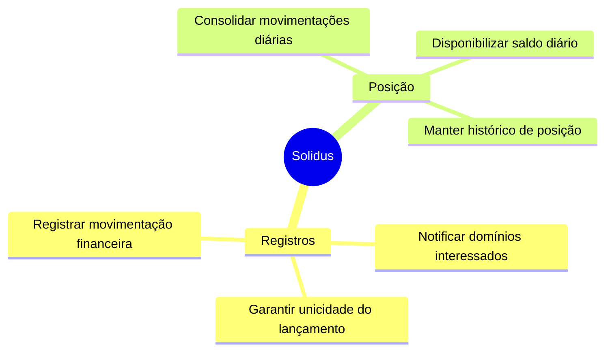

# Mapeamento de Domínios e Capacidades de Negócio

## 1. Visão geral

O sistema Solidus é organizado em dois domínios funcionais com responsabilidades distintas e complementares. Cada domínio representa uma área de negócio coesa, com suas próprias regras, linguagem e capacidades.

---

## 2. Domínio de Registros

### Propósito

Garantir que toda movimentação financeira realizada pelo comerciante seja capturada de forma confiável, imediata e sem perdas.

### Capacidades de negócio

| Capacidade | Descrição |
|------------|-----------|
| Registrar movimentação financeira | Permite ao comerciante informar uma entrada ou saída financeira com tipo, valor e data de competência |
| Garantir unicidade do lançamento | Assegura que a mesma movimentação não seja registrada mais de uma vez, independentemente de quantas vezes a operação seja submetida |
| Notificar domínios interessados | Comunica aos demais domínios do sistema que uma nova movimentação foi registrada, para que possam atualizar seus próprios estados |

### Escopo

| Dentro do escopo | Fora do escopo |
|-----------------|----------------|
| Registro de créditos e débitos | Cálculo de saldo |
| Validação das regras de negócio do lançamento | Consolidação diária |
| Garantia de entrega da notificação | Geração de relatórios |
| Histórico de movimentações do comerciante | Análise financeira |

---

## 3. Domínio de Posição

### Propósito

Oferecer ao comerciante uma visão consolidada da sua posição financeira diária, calculada a partir das movimentações registradas.

### Capacidades de negócio

| Capacidade | Descrição |
|------------|-----------|
| Consolidar movimentações diárias | Processa as movimentações registradas e calcula o saldo do dia, somando créditos e subtraindo débitos |
| Disponibilizar saldo diário | Permite ao comerciante consultar o saldo consolidado de qualquer dia |
| Manter histórico de posição | Preserva o consolidado de cada dia para consultas futuras |

### Escopo

| Dentro do escopo | Fora do escopo |
|-----------------|----------------|
| Cálculo de saldo diário | Registro de movimentações |
| Consulta de posição por data | Validação de lançamentos |
| Histórico de consolidados | Autenticação do comerciante |

---

## 4. Mapa de capacidades

